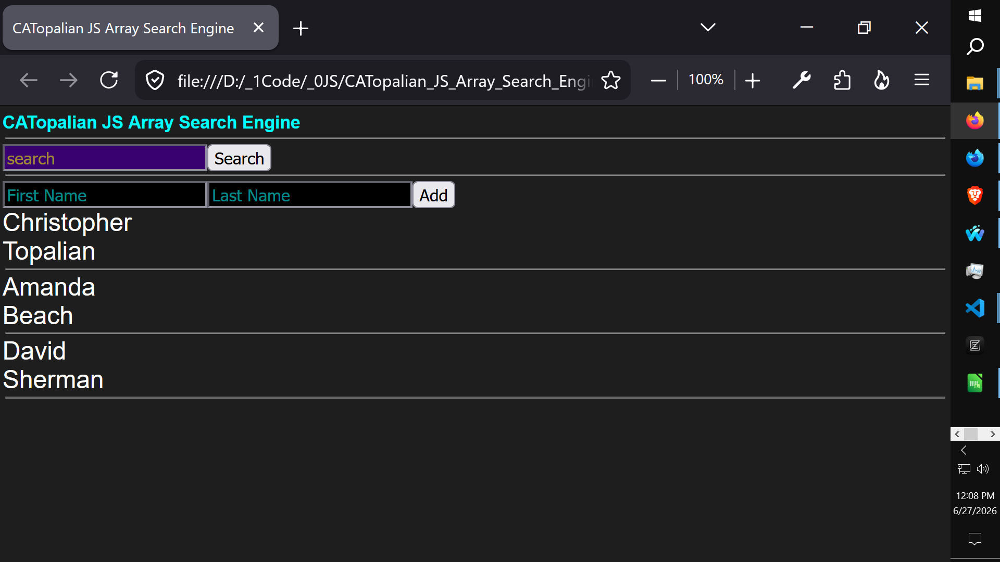

# CATopalian JS Array Search Engine v001
v001 A JavaScript app that teaches how to add objects and search an array.

Use App: https://christopherandrewtopalian.github.io/CATopalian_JS_Array_Search_Engine_v001/CATopalian_JS_Array_Search_Engine.html

---

How to Download this App
1. Click the green Code Button on this github page
2. Choose Download ZIP
3. Save the Zip File
4. Extract All
5. Double click the html file to start the Guitar App

---

//----//

// Dedicated to God the Father  
// All Rights Reserved Christopher Andrew Topalian Copyright 2000-2026  
// https://github.com/ChristopherTopalian  
// https://github.com/ChristopherAndrewTopalian  
// https://sites.google.com/view/CollegeOfScripting

